# Exemple de soumission d'activité
ÉTS - LOG430 - Architecture logicielle - Été 2026

Étudiant(e) : Chris-Emmanuel Berton

# Questions
(Il est obligatoire d'ajouter du code, des captures d'écran ou des sorties de terminal pour illustrer chacune de vos réponses.)

##  Question 1 : Combien d'utilisateurs faut-il pour que le Store Manager commence à échouer dans votre environnement de test ? Pour répondre à cette question, comparez la ligne Failures et la ligne Users dans les graphiques.
 N.B : réponses lorsque local

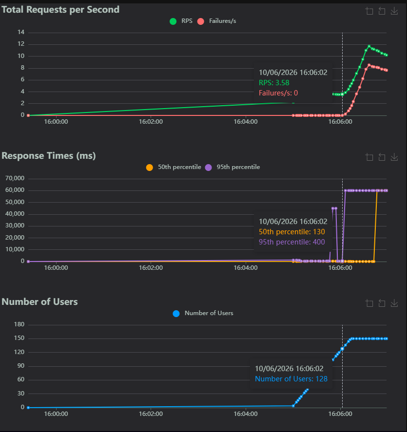

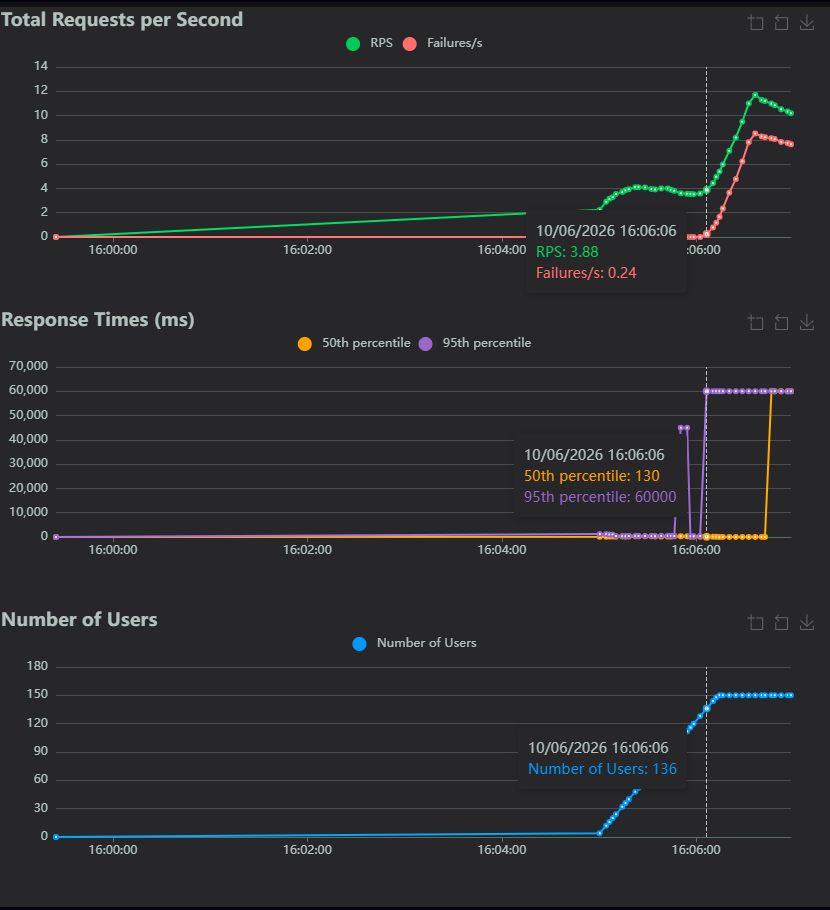

Le Store Manager commence à échouer  entre le 129e et le 136e utilisateur: il n'y a pas d'erreurs avant 128 Utilisateurs, mais il y a déjà des erreurs à compter du 136e
## 2. Question 2 : Sur l'onglet Statistics, comparez la différence entre les requêtes et les échecs pour tous les endpoints. Combien d'entre eux échouent plus de 50 % du temps ?
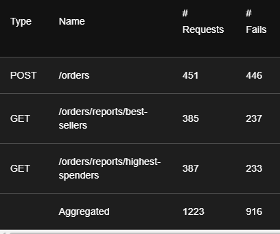

## 3.  Question 3 : Affichez quelques exemples des messages d'erreur affichés dans l'onglet Failures. Ces messages indiquent une défaillance dans quelle(s) partie(s) du Store Manager ? Par exemple, est-ce que le problème vient du service Python / MySQL / Redis / autre ?

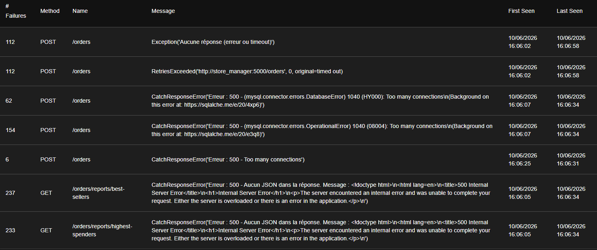

## 4.  Question 4 : Sur l'onglet Statistics, comparez les résultats actuels avec les résultats du test de charge précédent. Est-ce que vous voyez quelques différences dans les métriques pour l'endpoint POST /orders ?

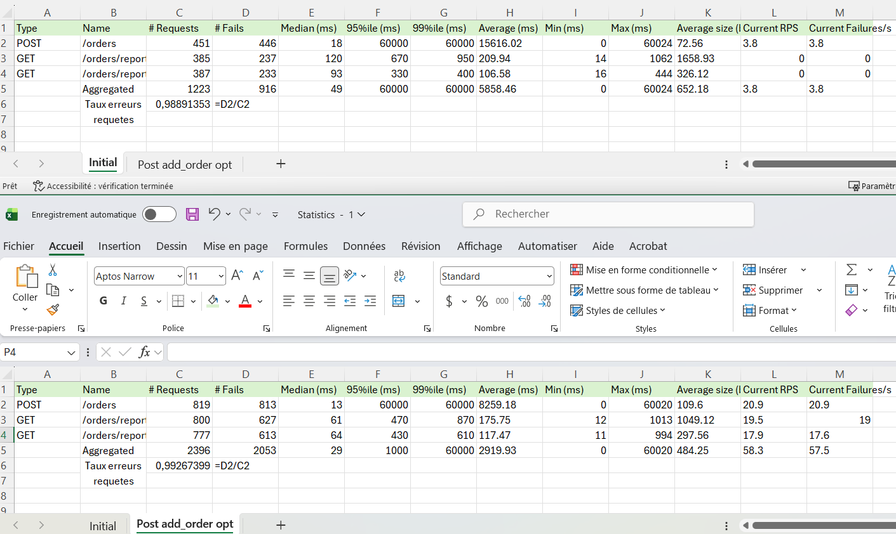

Il y a beaucoup plus de requêtes après l'optimisation de add_product. Aussi, le taux d'erreurs est vraisemblablement similaire. Donc, il n'y a globalement que des améliorations.

## 5.  Question 5 : Si nous avions plus d'articles dans notre base de données (par exemple, 1 million), ou simplement plus d'articles par commande en moyenne, le temps de réponse de l'endpoint POST /orders augmenterait-il, diminuerait-il ou resterait-il identique ?

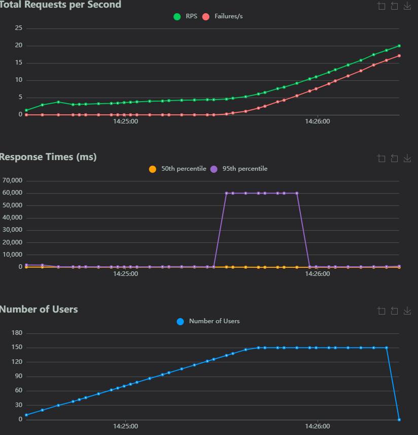

Considérant qu'une telle augmentation signifie une augmentation des ressources demandées par commandes, la prédiction serait que le temps de réponse diminuera. 

## 6.  Question 6 : Sur l'onglet Statistics, comparez les résultats actuels avec les résultats du test de charge précédent. Est-ce que vous voyez quelques différences significatives dans les métriques pour les endpoints POST /orders, GET /orders/reports/highest-spenders et GET /orders/reports/best-sellers ? Dans quelle mesure la performance s'est-elle améliorée ou détériorée (par exemple, en pourcentage) ?
Test en VM

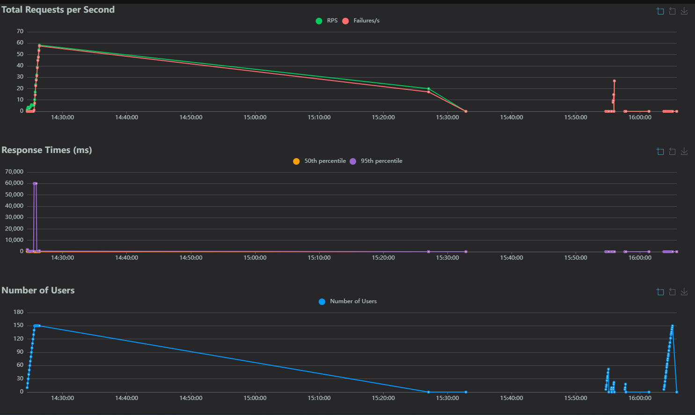

Test en local

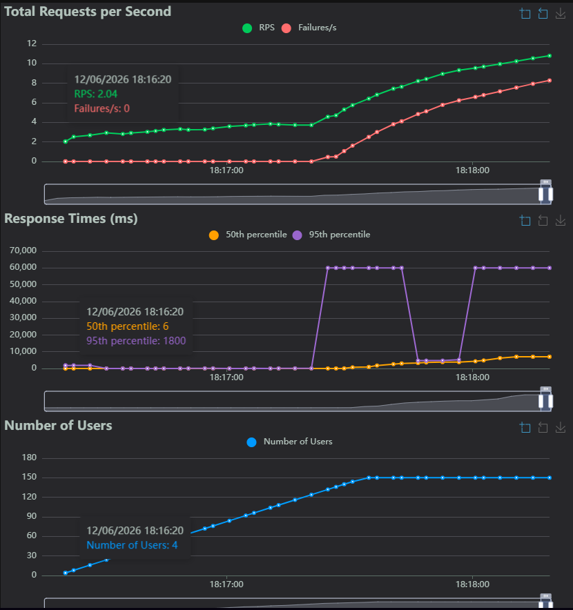

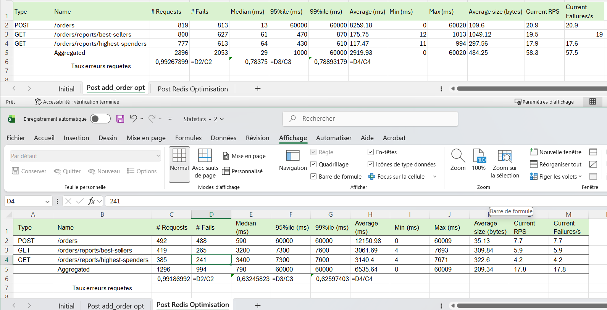

## 7.  Question 7 : La génération de rapports repose désormais entièrement sur des requêtes adressées à Redis, ce qui réduit la charge pesant sur MySQL. Cependant, le point de terminaison POST /orders reste à la traîne par rapport aux autres en termes de performances dans notre scénario de test. Alors, qu'est-ce qui limite les performances de l'endpoint POST /orders ?

L'endpoint POST /orders ne dépend pas de Redis ou MySQL, donc il reste non-affecté par le changement.

## 8. Question 8 : Sur l'onglet Statistics, comparez les résultats actuels avec les résultats du test de charge précédent. Est-ce que vous voyez quelques différences significatives dans les métriques pour les endpoints POST /orders, GET /orders/reports/highest-spenders et GET /orders/reports/best-sellers ? Dans quelle mesure la performance s'est-elle améliorée ou détériorée (par exemple, en pourcentage) ? La réponse dépendra de votre environnement d'exécution (par exemple, vous obtiendrez de meilleures performances en exécutant 2 instances de Store Manager sur 2 machines virtuelles plutôt que sur une seule).

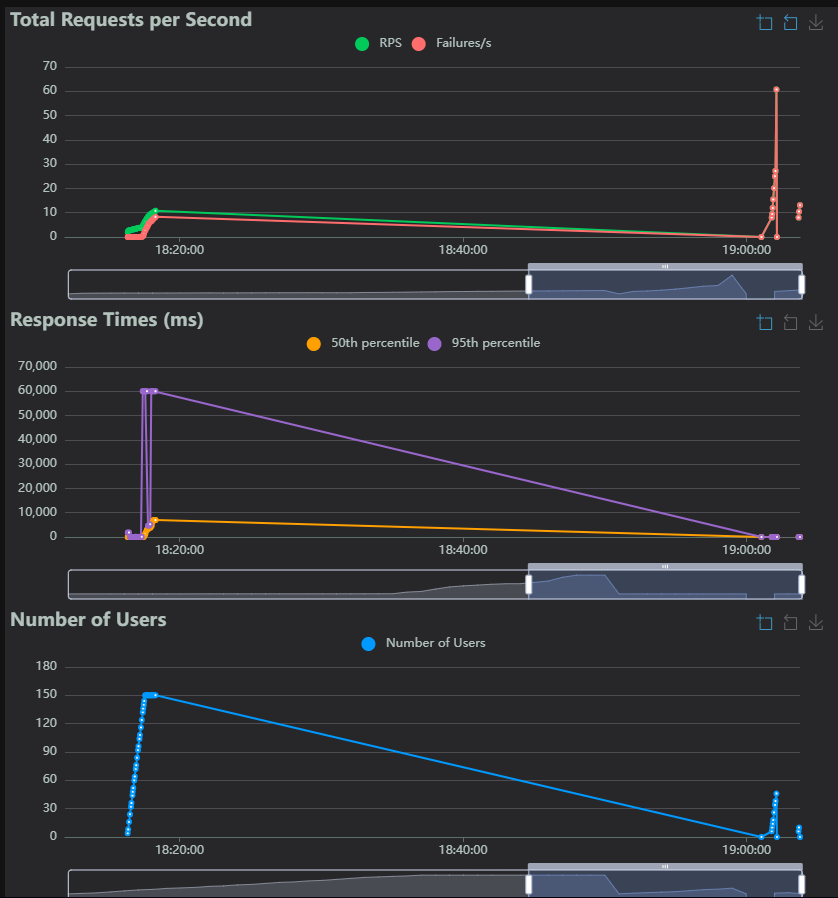

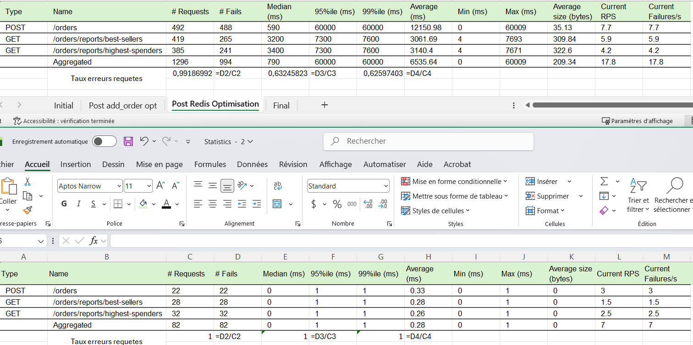

## 9.  Question 9 : Dans le fichier nginx.conf, il existe un attribut qui configure l'équilibrage de charge. Quelle politique d'équilibrage de charge utilisons-nous actuellement ? Consultez la documentation officielle de Nginx si vous avez des questions.

# Déploiement
(Le cas échéant, décrivez votre pipeline CI/CD et ce que vous avez appris dans ce laboratoire en ce qui concerne le déploiement. Il est obligatoire d'ajouter du code, des captures d'écran ou des sorties de terminal pour illustrer votre réponse.)

Message erreur lors run sur VM
'''
[2026-06-12 20:05:39,383] 4cbb64cbf451/INFO/FlaskAPIUser: Calling highest_spenders

[2026-06-12 20:05:39,386] 4cbb64cbf451/ERROR/locust.user.task: Port could not be cast to integer value as '5000 ' Traceback (most recent call last): File "/opt/venv/lib/python3.13/site-packages/locust/user/task.py", line 363, in run self.execute_next_task() ~~~~~~~~~~~~~~~~~~~~~~^^ File "/opt/venv/lib/python3.13/site-packages/locust/user/task.py", line 396, in execute_next_task self.execute_task(self._task_queue.popleft()) ~~~~~~~~~~~~~~~~~^^^^^^^^^^^^^^^^^^^^^^^^^^^^ File "/opt/venv/lib/python3.13/site-packages/locust/user/task.py", line 513, in execute_task task(self.user) ~~~~^^^^^^^^^^^ File "/mnt/locust/locustfile.py", line 72, in highest_spenders with self.client.get("/orders/reports/highest-spenders", catch_response=True) as response: ~~~~~~~~~~~~~~~^^^^^^^^^^^^^^^^^^^^^^^^^^^^^^^^^^^^^^^^^^^^^^^^^^^^^^^^^ File "/opt/venv/lib/python3.13/site-packages/locust/contrib/fasthttp.py", line 319, in get return self.request("GET", url, **kwargs) ~~~~~~~~~~~~^^^^^^^^^^^^^^^^^^^^^^ File "/opt/venv/lib/python3.13/site-packages/locust/contrib/fasthttp.py", line 263, in request response = self._send_request_safe_mode(method, built_url, payload=data, headers=headers, **kwargs) File "/opt/venv/lib/python3.13/site-packages/locust/contrib/fasthttp.py", line 172, in _send_request_safe_mode return self.client.urlopen(url, method=method, **kwargs) ~~~~~~~~~~~~~~~~~~~^^^^^^^^^^^^^^^^^^^^^^^^^^^^^^ File "/opt/venv/lib/python3.13/site-packages/geventhttpclient/useragent.py", line 397, in urlopen last_error = self._handle_error(e, url=req.url) File "/opt/venv/lib/python3.13/site-packages/geventhttpclient/useragent.py", line 334, in _handle_error raise e.with_traceback(sys.exc_info()[2]) File "/opt/venv/lib/python3.13/site-packages/geventhttpclient/useragent.py", line 392, in urlopen resp = self._urlopen(req) File "/opt/venv/lib/python3.13/site-packages/locust/contrib/fasthttp.py", line 687, in _urlopen client = self.clientpool.get_client(request.url_split) File "/opt/venv/lib/python3.13/site-packages/geventhttpclient/client.py", line 307, in get_client client_key = url.host, url.port ^^^^^^^^ File "/opt/venv/lib/python3.13/site-packages/geventhttpclient/url.py", line 72, in port raise ValueError(f"Port could not be cast to integer value as {port!r}") ValueError: Port could not be cast to integer value as '5000 '
'''
Cette erreur arrive lors de l'exécution du CD sur self-hosted server.
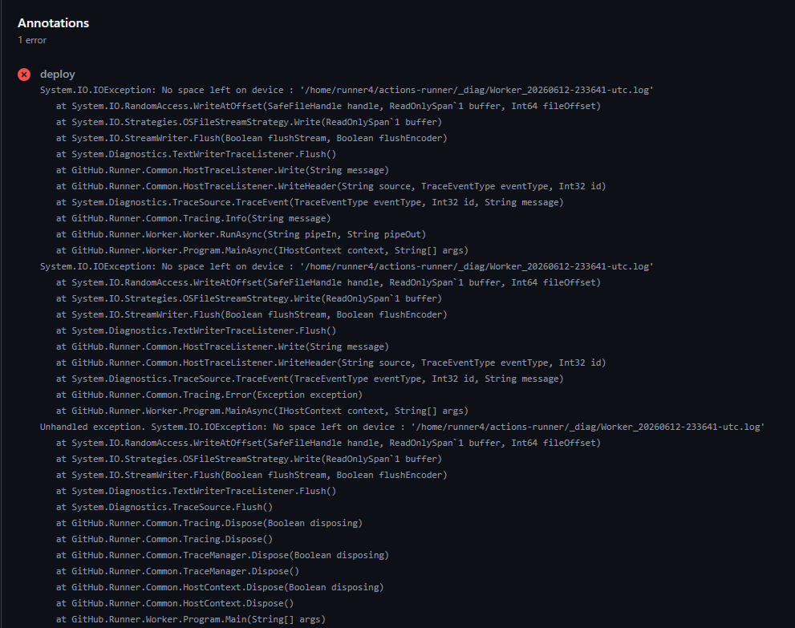